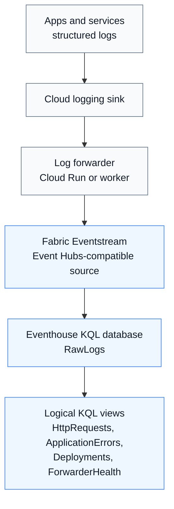
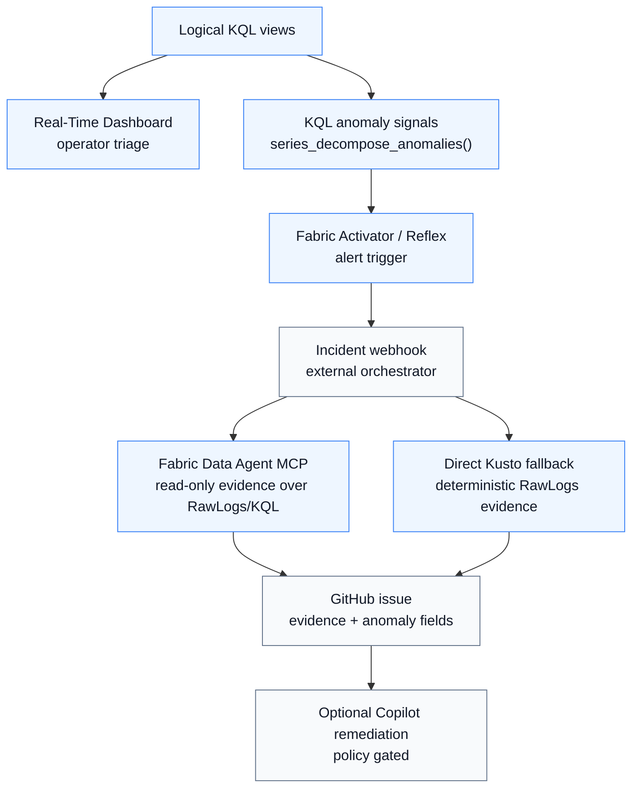

# GRIZL Fabric Observability

Public, sanitized Microsoft Fabric observability package for building an agentic incident-evidence loop on top of structured application telemetry.

This repo packages the Fabric side of the GRIZL observability architecture: Eventstream/Eventhouse ingestion, KQL logical views, Real-Time Dashboard queries, Activator/Reflex alert queries, Eventhouse-native anomaly signals, and Fabric Data Agent scaffolding for natural-language incident evidence retrieval over `RawLogs`. It is designed to pair with an external application/orchestrator service that receives Fabric alerts, asks Fabric Data Agent for evidence, creates GitHub issues, and assigns GitHub Copilot Coding Agent only when remediation is safe, scoped, and code-actionable.

```text
Application + frontend + deployment + forwarder telemetry
  -> cloud logging sink / Pub/Sub
  -> log forwarder
  -> Fabric Eventstream
  -> Eventhouse RawLogs
  -> KQL views + anomaly functions
  -> Activator / Reflex
  -> external incident webhook
  -> Fabric Data Agent MCP evidence query
  -> GitHub issue + optional Copilot Coding Agent handoff
```

This repository contains only the public/shareable Fabric package:

| Path | Purpose |
|---|---|
| `fabric/` | Fabric provisioning helpers, config templates, manifests, and dry-run-safe scripts |
| `kql/` | Eventhouse KQL views, dashboard queries, Activator alert queries, and anomaly-signal functions |
| `docs/fabric-incident-orchestrator.md` | Reference architecture for wiring Fabric Activator alerts to Fabric Data Agent evidence, GitHub issues, and Copilot remediation |

No tenant secrets, Event Hubs connection strings, Fabric tokens, GitHub tokens, or live tenant IDs are included. Replace placeholder values such as `<FABRIC_TENANT_ID>`, `<FABRIC_WORKSPACE_ID>`, and `<FABRIC_EVENTHUB_NAME>` with values from your own tenant.

## Architecture

### Telemetry path



### Detection, evidence, and response path



## What is included

The KQL artifacts assume a `RawLogs` Eventhouse table populated from structured application logs. The package provides:

- logical RawLogs views: `HttpRequests()`, `ApplicationErrors()`, `FrontendTelemetry()`, `Deployments()`, `ForwarderHealth()`
- dashboard tile queries for operational triage
- Activator/Reflex alert queries
- KQL-only anomaly signals using Eventhouse-native `series_decompose_anomalies()`
- Fabric Data Agent provisioning/staging scaffolding for evidence Q&A over `RawLogs` and selected KQL functions
- a reference external incident-orchestrator contract for alert normalization, GitHub issue creation, direct Kusto fallback evidence, and policy-gated Copilot assignment

The anomaly-signal layer intentionally covers high-value production signals only:

| Function | Signal |
|---|---|
| `BackendHttpErrorRateAnomalies()` | backend 5xx/error-rate anomalies by service and route |
| `RouteLatencyAnomalies()` | route p95 latency anomalies when `durationMs` is available |
| `ErrorSignatureSpikeAnomalies()` | repeated application error-signature spikes |
| `ForwarderFreshnessDropAnomalies()` | drops in forwarder freshness/healthy event volume |
| `ForwarderDropFailureAnomalies()` | skipped-message/retry/nack/failure spikes |
| `PostDeploymentRegressionAnomalies()` | post-deployment regressions by `deploymentSha` |
| `GrizlRecentAnomalySignals()` | union query suitable for a single Activator trigger |

## Fabric vs Databricks substitutions

The companion repo [grizl-databricks-observability](https://github.com/Metafiziks/grizl-databricks-observability) implements the same architecture on the Databricks/GCP stack. The table below maps each Fabric component to its Databricks equivalent for teams running one or both platforms.

| Fabric | Databricks |
|---|---|
| Cloud Logging → Pub/Sub → Fabric Eventstream | Cloud Logging → Pub/Sub → Cloud Storage export subscription → Auto Loader |
| `RawLogs` Eventhouse table | `grizl.observability.raw_logs` Delta table (Unity Catalog) |
| KQL logical functions (`HttpRequests()`, `ApplicationErrors()`, …) | SQL logical views (`http_requests`, `application_errors`, …) |
| `series_decompose_anomalies()` | z-score via `STDDEV`/`AVG` over `FLOOR(UNIX_TIMESTAMP/300)*300` time bins |
| Fabric Activator / Reflex alert trigger | Databricks Workflow (5-min cron) |
| Fabric Data Agent (MCP) | Genie (AI/BI) — natural language → SQL over Delta tables |
| Direct Kusto fallback | Spark SQL / SQL warehouse fallback |
| Real-Time Dashboard | Databricks SQL Dashboard |
| Entra M2M client credentials | Databricks OAuth M2M (service principal) |
| External orchestrator webhook → GitHub issue | Workflow notebook calls GitHub API directly — no external webhook |

## Quick start

1. Copy the config template and fill in tenant-specific non-secret values:

   ```bash
   cp fabric/config/grizl.fabric.env.example fabric/config/grizl.fabric.env
   ```

2. Run local checks:

   ```bash
   npm run fabric:check
   ```

3. Dry-run the anomaly-signal Kusto management command:

   ```bash
   npm run fabric:kusto:anomaly-signals:dry-run
   ```

4. Apply KQL after reviewing the output and authenticating with an authorized Azure/Fabric identity:

   ```bash
   npm --prefix fabric run kusto:anomaly-signals
   ```

See `fabric/README.md` for provisioning/Data Agent staging details and `docs/fabric-incident-orchestrator.md` for the incident-enrichment and Copilot handoff flow.

## Fabric Data Agent role

Fabric Data Agent is the read-only evidence layer. It is configured over the Eventhouse KQL database so an external orchestrator can ask incident-specific questions such as:

- Which deployment SHA correlates with this new 5xx spike?
- Which route, page, or error signature is driving the anomaly?
- Did forwarder health degrade before the alert fired?
- What validation KQL should an operator or Copilot-authored PR use after remediation?

Data Agent does not create issues or execute remediation. The external orchestrator owns webhook authentication, repository mapping, GitHub issue creation, remediation policy, and Copilot Coding Agent assignment. Direct Kusto fallback remains part of the reference design so incident issues still get deterministic RawLogs evidence if the Data Agent runtime cannot access its datasource.

## What is intentionally excluded

- No tenant-specific Fabric item definitions with live IDs.
- No Fabric tokens, Event Hubs connection strings, GitHub tokens, service-principal secrets, or webhook secrets.
- No fake MLflow/model-registry workflow. The ML-observability layer here is KQL anomaly scoring over operational telemetry because that adds real incident value without inventing a model lifecycle.

## Security notes

- Do not commit `fabric/config/grizl.fabric.env`.
- Do not commit Event Hubs-compatible connection strings or SAS keys.
- Keep Fabric service-principal secrets, webhook secrets, and GitHub tokens in your secret manager.
- `fabric/scripts/check.sh` scans `fabric/` for Event Hubs connection-string material as a local guardrail.
